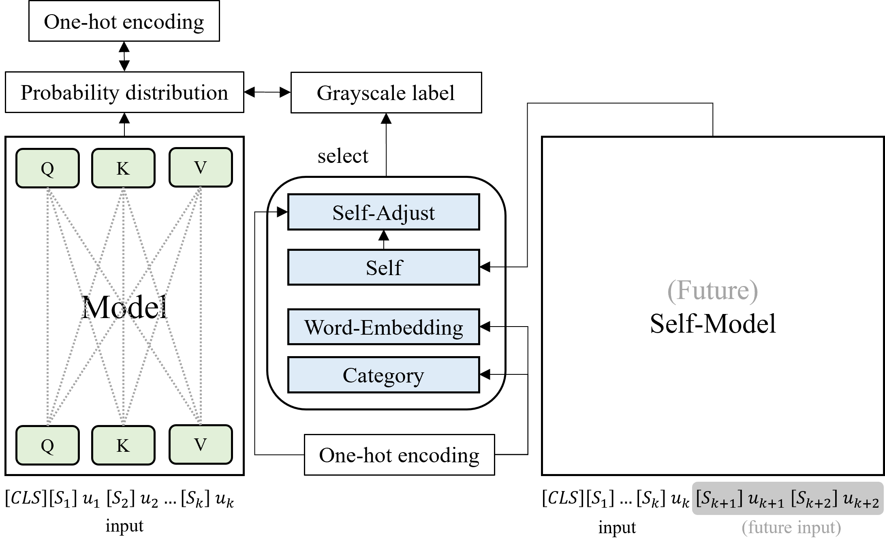

# The Emotion is Not One-hot Encoding: Learning with Grayscale Label for Emotion Recognition in Conversation (INTERSPEECH 2022)


- The overall flow of our model. 
- This repository provides training/test codes for RoBERTa. Please use each open source for extensions to the comparison system.

## Requirements
1. Pytorch 1.8
2. Python 3.6
3. [Transformer 4.4.0](https://github.com/huggingface/transformers)
4. sklearn

## Datasets
Each data is split into train/dev/test in the [dataset folder](https://github.com/rungjoo/Emotion_not_Binary/tree/master/dataset).
1. [IEMOCAP](https://sail.usc.edu/iemocap/iemocap_publication.htm)
2. [DailyDialog](http://yanran.li/dailydialog.html)
3. [MELD](https://github.com/declare-lab/MELD/)
4. [EmoryNLP](https://github.com/emorynlp/emotion-detection)

## Train
**Step1: Training teacher model**

- For self-method
```bash
cd self_teacher
python3 train.py {--argument}
```

- For future-self-method
```bash
cd self_future_teacher
python3 train.py {--argument}
```

**Step2: Training student model**
```bash
cd gray
python3 train_{method}.py {--argument}
```
- method names
    - C: category method
    - W: word-embedding method
    - F: future-self-method
    - S: self-methoid
    - SA: self-adjust method

- Argument
    - gray: heuristic (C), word (W), teacher (S), teahcer_post (SA), teacher_future (FS), teacher_future_post (FSA)
    - pretrained: pretraeind model type (roberta-large)
    - cls: label class (emotion or sentiment) (default: emotion)
    - weight: weight value for loss (in paper, it is marked as $\alpha$.)

## Citation

```bibtex
not yet
```